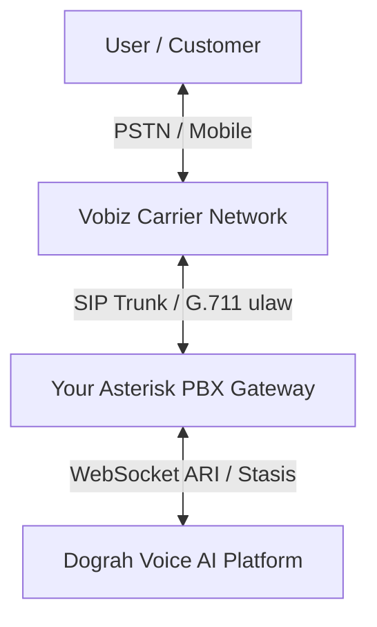

# Cost-Optimized Voice AI: Vobiz SIP Trunk + Asterisk ARI to Dograh

Integrating **Vobiz SIP Trunking** with a self-hosted **Asterisk PBX** is the most cost-effective way to deploy Voice AI. By hosting your own Asterisk gateway, you bypass high third-party telephony platform markups and pay only the raw wholesale carrier rates from Vobiz.



---

## 🛠️ Complete Server Installation & Setup Guide

This guide is designed for a standard **Ubuntu 22.04 LTS or 24.04 LTS** server instance where Asterisk will be hosted.

### Step 1: Install Asterisk & Dependencies
Run the following commands on your server to install Asterisk along with the required WebSocket and security modules:

```bash
sudo apt update
sudo apt install -y asterisk asterisk-modules
```

### Step 2: Verify Required WebSocket Modules
Dograh communicates with Asterisk using a WebSocket media stream. Ensure these modules are present and active:
```bash
# Verify websocket channels are loaded
asterisk -rx "module show like chan_websocket"
asterisk -rx "module show like res_websocket_client"
```
*Both commands should report **Running**.*

---

## 📁 Pre-Configured Asterisk Files

Replace or update your Asterisk configuration files in `/etc/asterisk/` with the optimized templates below.

### 1. `pjsip.conf` — Vobiz SIP Registry & Endpoint
Configure Asterisk to register with Vobiz and establish the SIP trunk using your credentials.

```ini
[global]
type=global
user_agent=Dograh-Asterisk-Gateway

; 1. Network Transport (UDP)
[transport-udp]
type=transport
protocol=udp
bind=0.0.0.0

; 2. Registry with Vobiz Domain
[vobiz-reg]
type=registration
transport=transport-udp
outbound_auth=vobiz-auth
server_uri=sip:your_vobiz_domain.sip.vobiz.ai
client_uri=sip:your_vobiz_username@your_vobiz_domain.sip.vobiz.ai
retry_interval=60

; 3. Authentication Credentials
[vobiz-auth]
type=auth
auth_type=userpass
username=your_vobiz_username
password=your_vobiz_password

; 4. Outbound Endpoint representing Vobiz Trunk
[vobiz-trunk]
type=endpoint
transport=transport-udp
context=from-external
disallow=all
allow=ulaw         ; Forced G.711 u-law to prevent transcoding latency and reduce CPU load
outbound_auth=vobiz-auth
aors=vobiz-aor

; 5. Address of Record for Vobiz
[vobiz-aor]
type=aor
contact=sip:your_vobiz_domain.sip.vobiz.ai
```

### 2. `ari.conf` — Asterisk REST Interface Credentials
Create an authenticated user context that Dograh uses to manage the phone call and audio stream.

```ini
[general]
enabled = yes
pretty = yes

[dograh]
type = user
read_only = no
password = your_secure_ari_password_here
```

### 3. `http.conf` — Enable Asterisk Web Server
Expose the HTTP port so Dograh can send REST requests to control the channels.

```ini
[general]
enabled = yes
bindaddr = 0.0.0.0
bindport = 8088
```

### 4. `extensions.conf` — Dialplan Routing
Route incoming trunk calls directly into the `Stasis` execution application named `dograh`.

```ini
[from-external]
exten => _X.,1,NoOp(Incoming call from Vobiz to AI Extension: ${EXTEN})
 same => n,Stasis(dograh)
 same => n,Hangup()
```

### 5. `websocket_client.conf` — External Media Stream Connection
Initiates the outgoing connection from Asterisk to the Dograh WebSocket server to transmit live, low-latency audio.

```ini
[dograh]
type = websocket_client
uri = wss://api.dograh.com/api/v1/telephony/ws/ari
protocols = media
tls_enabled = yes
ca_list_file = /etc/ssl/certs/ca-certificates.crt
```

---

## 🔒 Security & Performance Hardening (Crucial)

To prevent unauthorized third-party scanning, keep costs low, and ensure sub-100ms latency:

1. **Restrict Port 5060 (SIP) & 8088 (ARI)**:
   Use `ufw` to restrict incoming connections to known Vobiz and Dograh IP addresses:
   ```bash
   # Allow Vobiz outbound trunk server
   sudo ufw allow from 43.225.22.33 to any port 5060 proto udp comment "Vobiz SIP Trunk"
   
   # Allow Dograh Platform to communicate with ARI (Replace with Dograh IP if self-hosted)
   sudo ufw allow from api.dograh.com to any port 8088 proto tcp comment "Dograh ARI API"
   ```
2. **Codec Optimization**:
   Always force `allow=ulaw` (G.711 μ-law). By keeping both Vobiz and Dograh on `ulaw`, Asterisk forwards audio packets natively with **zero transcoding CPU overhead**.

---

## 🚀 Verification & Live Debugging Commands

After configuring and restarting Asterisk, run these CLI commands (`asterisk -rvvv`) to verify setup:

* **Verify SIP Trunk Registration**:
  ```bash
  pjsip show registrations
  ```
  *Ensure the status reports **Registered**.*

* **Verify Endpoint is online**:
  ```bash
  pjsip show endpoints
  ```

* **Inspect ARI application connectivity**:
  ```bash
  ari show apps
  ```
  *Make sure the `dograh` app is registered and active.*

* **Live call trace**:
  ```bash
  pjsip set logger on
  ```
